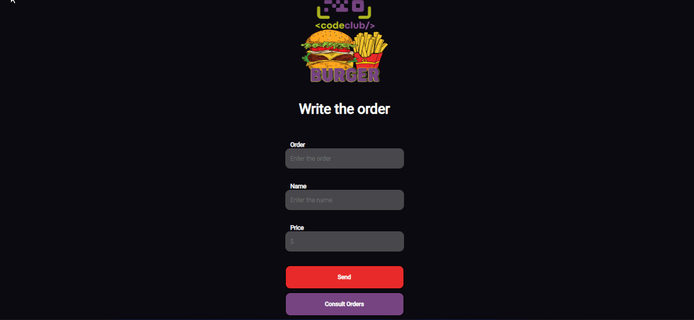

# App Hamburgueria

> Projeto finalizado 
 

## 💻 Sobre o Projeto

Este projeto trata-se de um app com a interface de hamburgueria, onde você cadastra o pedido, nome e valor do pedido.

Fiz o uso do <b>Styled-componentes</b> para criar a interface, <b>React Hooks</b> (useEffect, useState, useRef) para as funcionalidades da aplicação, <b>react-router-dom</b> para navegação entre paginas, <b>Axios</b> para utilizar as rotas de uma API que fiz recentemente, contendo rotas get, post, delete.

 

## ☕ Tecnologias utilizadas

 

## 💙 Colaborador

<table>
  <tr>
    <td align="center">
      <a href="#">
         
        
          <a >Matheus Juvenal</a>
        
      </a>
    </td>
  </tr>
</table>

  

 

[⬆ Voltar ao topo](#App-Hamburgueria) 
